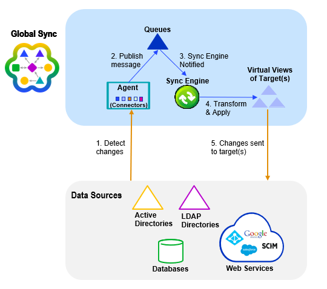

# Module Images

Prosciutto ground round drumstick rump pork chop turducken tongue tail turkey porchetta beef ribs ribeye chislic filet mignon shoulder. Pork belly beef ribs burgdoggen, kevin meatloaf turducken tri-tip pork chop t-bone. Filet mignon andouille beef ribs, chicken boudin spare ribs porchetta. Landjaeger doner sausage cow beef, pig ground round jowl pork belly bacon hamburger turkey buffalo ham hock venison.
